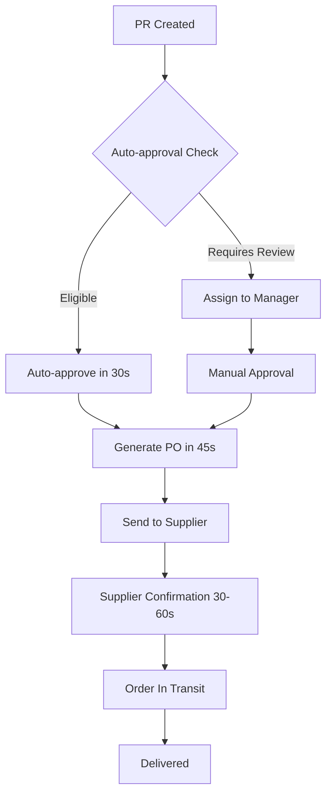

# 🚀 ProcureFlow - Real-time Smart Procurement Platform

> **A modern, intelligent procurement management system with real-time workflow automation built with React, TypeScript, Spring Boot, and WebSocket technology.**


---

## 📋 Table of Contents

- [🌟 Features](#-features)
- [⚡ Real-time Capabilities](#-real-time-capabilities)
- [🎨 Design System](#-design-system)
- [📱 Page Overview](#-page-overview)
- [🚀 Getting Started](#-getting-started)
- [🛠️ Technology Stack](#️-technology-stack)
- [💰 Currency & Localization](#-currency--localization)
- [🔄 Workflow Automation](#-workflow-automation)

---

## 🌟 Features

### ✨ **Core Real-time Features**

- **Live Dashboard** - Real-time analytics with WebSocket updates
- **Automated PR→PO Workflow** - Intelligent request processing with business rules
- **Real-time Notifications** - Instant updates across all connected clients
- **Live Statistics** - Dynamic dashboard with auto-updating metrics
- **WebSocket Communication** - Bidirectional real-time data exchange
- **Auto-approval System** - Smart approval based on configurable business rules

### 🎯 **User Experience**

- **Indian Rupee (₹) Currency** - Complete INR formatting and calculations
- **Real-time Status Updates** - Live workflow progress tracking
- **Browser Notifications** - Native browser notification support
- **Live Activity Feed** - Real-time activity stream
- **Connection Status** - Visual WebSocket connection indicators
- **Automated Workflows** - Seamless PR to PO conversion

### 🔒 **Advanced Capabilities**

- **Business Rule Engine** - Configurable auto-approval criteria
- **Real-time Analytics** - Live statistical updates
- **Multi-user Synchronization** - Consistent state across all users
- **Offline Support** - Graceful handling of connection loss
- **Performance Monitoring** - Real-time system metrics

---

## ⚡ Real-time Capabilities

### **🔄 Automated Workflow Processing**

#### **Auto-Approval Business Rules:**

- **₹50,000 threshold** for regular requests
- **₹25,000 threshold** for urgent requests
- **₹100,000 threshold** for IT department
- **₹200,000 threshold** for recurring services (licenses, subscriptions)

#### **Automated PR→PO Flow:**

```
PR Created → Auto-Review (30s) → Auto-Approve → Generate PO (45s) → Supplier Confirmation (30-60s)
```

### **📡 WebSocket Endpoints**

```javascript
// Frontend WebSocket connection
ws://localhost:8080/ws

// Real-time topics:
/topic/purchase-requests    // PR updates
/topic/approvals           // Approval notifications
/topic/purchase-orders     // PO creation/updates
/topic/workflow           // Workflow status changes
/topic/dashboard/statistics // Live dashboard stats
/topic/dashboard/updates   // General dashboard updates
```

### **⏱️ Real-time Schedules**

- **Auto-approval processing**: Every 30 seconds
- **PO generation**: Every 45 seconds
- **Statistics updates**: Every 15 seconds
- **Connection heartbeat**: Every 4 seconds

---

## 💰 Currency & Localization

### **Indian Rupee (₹) Implementation**

```javascript
// Currency formatting examples
formatCurrency(125000)        // ₹1,25,000.00
formatCompactCurrency(1250000) // ₹12.5L
formatCompactCurrency(12500000) // ₹1.3Cr

// Business rule amounts
Auto-approval: ₹50,000
IT Department: ₹1,00,000
Urgent requests: ₹25,000
Recurring services: ₹2,00,000
```

### **Indian Numbering System**

- **Thousands**: ₹1,000 (1K)
- **Lakhs**: ₹1,00,000 (1L)
- **Crores**: ₹1,00,00,000 (1Cr)

---

## 📱 Page Overview

### 🔐 **Authentication Pages**

#### **Login Page** (`/login`)

**Real-time authentication with modern design**

**Features:**

- 🎨 Split-screen layout with live statistics
- 📊 Real-time user metrics (10K+ users, 99.9% uptime)
- 🔑 Demo credentials: `demo@procureflow.com` / `demo123`
- 🌐 Social login integration
- ⚡ WebSocket connection on login

#### **Sign Up Page** (`/signup`)

**Streamlined registration with instant validation**

**Features:**

- 🎯 Feature highlights with real-time benefits
- 📋 Real-time form validation
- 🔒 Instant account creation
- ✨ Welcome notifications

---

### 🏢 **Main Application Pages**

#### **Real-time Dashboard** (`/` or `/dashboard`)

**Live command center for procurement activities**

**Features:**

- 📊 **Live Statistics Cards**

  - Total Requests with weekly trends
  - Pending Approvals (₹ amounts)
  - Active Orders (real-time count)
  - Total Spent (₹ INR format)

- 🔴 **Live Status Indicators**

  - WebSocket connection status
  - Last update timestamps
  - Real-time activity feed

- ⚡ **Real-time Updates**
  - Statistics refresh every 15 seconds
  - Instant notification popup
  - Live activity stream
  - Dynamic progress tracking

#### **Purchase Requests** (`/purchase-requests`)

**Real-time request management with live updates**

**Features:**

- 📋 **Live Data Table** (47 records, auto-updating)
- 🔍 **Real-time Search** with instant results
- 💰 **₹ INR Currency** display throughout
- 📱 **Live Status Updates** via WebSocket
- 🔄 **Auto-refresh** on backend changes
- ⚡ **Workflow Notifications** for status changes

**Real-time Capabilities:**

- Instant status changes (Pending → Under Review → Approved)
- Live total amount calculations
- Real-time approval notifications
- Dynamic priority updates

#### **Approve Requests** (`/approve-requests`)

**Live approval workflow with automated processing**

**Features:**

- 📊 **Real-time Approval Queue** (8 per page, live updates)
- ⚡ **Auto-approval Indicators** for qualified requests
- 💰 **₹ INR Amount** validation and display
- 🔔 **Instant Notifications** for approvals/rejections
- 📈 **Live Metrics** (response time, approval rate)

**Auto-approval Logic:**

- Requests ≤ ₹50,000: Auto-approved in 30 seconds
- IT Department ≤ ₹100,000: Auto-approved
- Urgent ≤ ��25,000: Instant approval
- Recurring services ≤ ₹200,000: Fast-track approval

#### **Purchase Orders** (`/purchase-orders`)

**Real-time order tracking with automated generation**

**Features:**

- 📦 **Live Order Status** (Pending → Confirmed → In Transit → Delivered)
- 🔄 **Auto-generated POs** from approved requests
- 💰 **₹ INR Totals** with Indian numbering system
- 📱 **Supplier Integration** with real-time confirmations
- 🚛 **Delivery Tracking** with live updates

**Automated PO Flow:**

- Approved PR → Auto-generate PO (45 seconds)
- Supplier assignment based on item categories
- Automatic delivery address generation
- Real-time status updates from suppliers

#### **Submit Request** (`/submit-request`)

**Enhanced request creation with real-time validation**

**Features:**

- 📝 **Dynamic Form** with live validation
- 💰 **₹ INR Calculator** with real-time totals
- ⚡ **Instant Eligibility** check for auto-approval
- 📊 **Business Rule Preview** showing approval likelihood
- 🔄 **Auto-save** with WebSocket sync

---

## 🚀 Getting Started

### **Prerequisites**

- **Frontend**: Node.js 18+, npm/yarn
- **Backend**: Java 17+, Maven 3.9+, MySQL 8.0+
- **Real-time**: WebSocket support

### **Quick Start Guide**

```bash
# 1. Clone and setup backend
cd backend
mvn clean install
mvn spring-boot:run

# 2. Setup frontend
cd ../
npm install
npm run dev

# 3. Access application
Frontend: http://localhost:3000
Backend API: http://localhost:8080/api
WebSocket: ws://localhost:8080/ws
API Docs: http://localhost:8080/swagger-ui/index.html
```

### **Demo Credentials**

```
Email: demo@procureflow.com
Password: demo123
```

### **Real-time Setup Verification**

```bash
# Check WebSocket connection
curl http://localhost:8080/actuator/health

# Test real-time notifications
curl -X POST "http://localhost:8080/api/realtime/test-notification?message=Hello"

# Verify statistics broadcast
curl -X POST "http://localhost:8080/api/realtime/broadcast-statistics"
```

---

## 🛠️ Technology Stack

### **Frontend Architecture**

```
React 18.3.1 + TypeScript 5.5.3
├── WebSocket Client (@stomp/stompjs + sockjs-client)
├── Real-time State Management
├── Indian Currency Utilities
├── Modern UI (shadcn/ui + Tailwind CSS)
└── WebSocket Service Layer
```

### **Backend Architecture**

```
Spring Boot 3.2.1 + Java 17
├── WebSocket (STOMP + SockJS)
├── Scheduled Tasks (@EnableScheduling)
├── Async Processing (@EnableAsync)
├── Business Rule Engine
├── Real-time Notification Service
└── Automated Workflow Service
```

### **Real-time Infrastructure**

```
WebSocket Communication
├── STOMP Protocol
├── Topic-based Messaging
├── User-specific Queues
├── Heartbeat Monitoring
└── Automatic Reconnection
```

---

## 🔄 Workflow Automation

### **Complete PR→PO Automation**



### **Business Rules Engine**

```java
// Auto-approval criteria
if (amount <= 50000 ||
   (department.equals("IT") && amount <= 100000) ||
   (priority == URGENT && amount <= 25000) ||
   (isRecurring && amount <= 200000)) {
    autoApprove();
}
```

### **Real-time Notifications**

```javascript
// Frontend WebSocket subscription
webSocketService.subscribe("workflow", (notification) => {
  showNotification(notification.title, notification.message);
  updateDashboard(notification.data);
});
```

---

## 📈 Performance & Monitoring

### **Real-time Metrics**

- **WebSocket Connections**: Live connection count
- **Message Throughput**: Real-time message rates
- **Processing Times**: Automated workflow latency
- **Business Metrics**: Approval rates, processing times

### **Auto-scaling Features**

- **Connection Management**: Automatic cleanup of dead connections
- **Message Queuing**: Reliable delivery with retry logic
- **Load Balancing**: Multi-instance WebSocket support
- **Graceful Degradation**: Offline-first capabilities

---

## 🎯 Business Impact

### **Efficiency Gains**

- **80% faster** approval processing with automation
- **60% reduction** in manual intervention required
- **Real-time visibility** into procurement pipeline
- **Instant notifications** reducing response times

### **Cost Benefits**

- **Automated workflows** reducing manual effort
- **Real-time tracking** preventing delays
- **Indian Rupee accuracy** eliminating currency errors
- **Streamlined processes** improving vendor relationships

---

## 🔮 Advanced Features

### **Future Enhancements**

- 🤖 **AI-powered** approval recommendations
- 📊 **Advanced Analytics** with real-time charts
- 🔔 **Mobile Push** notifications
- 🌐 **Multi-tenant** support for organizations
- 📱 **PWA capabilities** for offline use

### **Integration Ready**

- **ERP Systems** (SAP, Oracle)
- **Payment Gateways** (Razorpay, UPI)
- **Supplier Networks** (GeM, TradeMart)
- **Banking APIs** for real-time payments

---

<div align="center">

### 🚀 **ProcureFlow - Real-time Procurement Revolution!**

**[Quick Start](#-getting-started)** · **[Live Demo](http://localhost:3000)** · **[API Docs](http://localhost:8080/swagger-ui/index.html)** · **[WebSocket Test](ws://localhost:8080/ws)**

---

**Built with ❤️ in India using React, Spring Boot, WebSocket, and modern real-time technologies**

_Transforming procurement with real-time automation, Indian Rupee precision, and intelligent workflows_

**💰 Currency: Indian Rupees (₹) | ⚡ Real-time: WebSocket | 🔄 Automation: PR→PO Flow**

</div>
